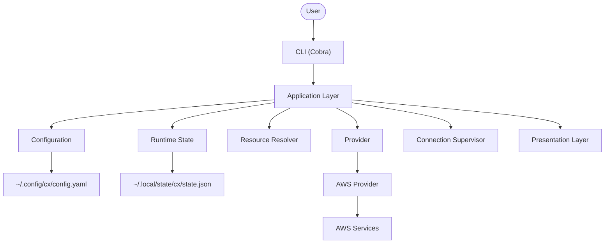
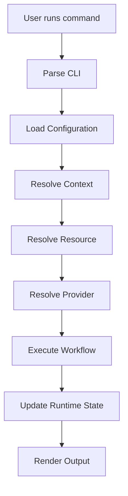
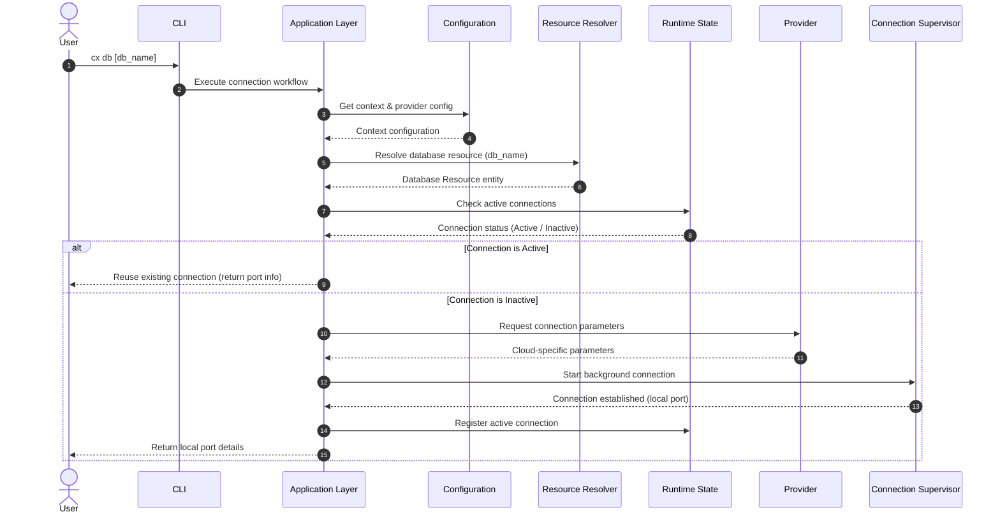

# Architecture Document: cx

This document describes the architecture of **cx**, a workflow-oriented cloud operations CLI.

The architecture is designed around **workflows**, **resource abstractions**, and **provider independence** rather than cloud-specific APIs.

The first release (v0.1) targets AWS, while the architecture is designed to support additional providers such as Azure and GCP without fundamental changes.

---

# 1. Architectural Goals

## Workflow-Oriented
Expose high-level workflows instead of cloud APIs.

Examples:
```
cx db
cx logs
cx compute
```
rather than long cloud-specific commands.

---

## Provider Independent
Core application logic must not depend on any cloud provider. Cloud providers implement a common interface.

---

## Configuration Driven
Infrastructure topology should be declared through configuration. Business logic must never hardcode cloud resources.

---

## Cross Platform
The architecture should work consistently across Linux, macOS, and Windows. Platform-specific implementations should remain isolated.

---

## Discoverability First
Users should rarely need to remember resource names, ports, instance IDs, or endpoints. Whenever possible, cx should discover available resources and present interactive choices.

---

# 2. Design Principles

## Workflow over APIs
Commands represent operational workflows rather than cloud provider APIs.

Examples:
- `cx db` (Good)
- `cx logs` (Good)
- `cx compute` (Good)
- `cx rds` (Avoid)
- `cx elasticache` (Avoid)
- `cx ssm` (Avoid)

---

## Discover over Configure
Whenever possible, cx should discover resources instead of requiring explicit identifiers.

---

## Convention over Configuration
Reasonable defaults should minimize required user input.

---

## Provider Independence
Business logic must remain provider agnostic.

---

## Long-running Operations are First-class
Persistent connections (such as database and cache tunnels) are a core capability of cx.

---

## Human-first UX
Interactive prompts should be preferred over cryptic flags whenever possible.

---

## AI-friendly Architecture
The codebase should remain understandable by both human contributors and AI coding agents. Architectural boundaries must be explicit.

---

# 3. High-Level Architecture



---

# 4. Core Subsystems

## CLI
Responsible for:
- parsing commands
- parsing flags
- validation
- invoking application services

The CLI must never contain business logic.

---

## Application Layer
The Application Layer coordinates workflows.

Examples:
- connect to database
- reuse tunnel
- resolve current context
- update runtime state

All workflow logic belongs here.

---

## Configuration
Responsible for loading and saving configuration.

Responsibilities:
- contexts
- resources
- provider configuration
- user preferences

Configuration is immutable during command execution.

---

## Runtime State
Stores dynamic information.

Examples:
- active context
- active tunnels
- runtime metadata

Runtime state is independent of configuration.

---

## Resource Resolver
Responsible for resolving resources.

Examples:
- databases
- caches
- search clusters
- compute instances
- services

The resolver provides:
- discovery
- filtering
- lookup
- alias resolution

---

## Provider
Defines provider-specific implementations.

Examples:
- AWS
- Azure
- GCP

The provider translates generic resource operations into cloud-specific implementations.

---

## Connection Supervisor
Responsible for managing long-running connections.

Examples:
- database tunnels
- cache tunnels
- search tunnels

Responsibilities:
- start
- stop
- reuse
- monitor
- cleanup

The implementation mechanism is abstract. Version 0.1 may use tmux. Future implementations may use platform-native background services.

---

## Presentation Layer
Responsible for user interaction.

Examples:
- Bubble Tea
- prompts
- progress indicators
- tables

Presentation should never contain workflow logic.

---

## Dependency Manager
Responsible for validating external tooling.

Examples:
- AWS CLI
- Session Manager Plugin
- tmux
- psql
- redis-cli

Responsibilities:
- detection
- version checking
- installation guidance

---

# 5. Execution Flows

## General Workflow Execution



## Connection Lifecycle Sequence

This sequence details how components coordinate to connect to a resource (e.g. `cx db`).



---

# 6. Configuration & State Models

Configuration and runtime state are intentionally separated.

## Configuration Model (`~/.config/cx/config.yaml`)

```yaml
version: "1.0"
contexts:
  staging:
    provider: aws
    aws:
      profile: staging-admin
      region: us-east-1
    resources:
      databases:
        - name: mercury
          engine: postgres
          endpoint: mercury-rds.c12345.us-east-1.rds.amazonaws.com
          port: 5432
          local_port: 5432
          bastion_instance_id: i-0abcd1234efgh5678
      caches:
        - name: redis-main
          endpoint: redis-main.elasticache.us-east-1.amazonaws.com
          port: 6379
          local_port: 6379
          bastion_instance_id: i-0abcd1234efgh5678
```

## Runtime State Model (`~/.local/state/cx/state.json`)

```json
{
  "current_context": "staging",
  "active_connections": {
    "staging/database/mercury": {
      "type": "database",
      "name": "mercury",
      "local_port": 5432,
      "connection_id": "cx-conn-staging-db-mercury",
      "connected_at": "2026-07-11T00:25:00Z"
    }
  }
}
```

---

# 7. Provider Model

Providers implement cloud-specific functionality. Communication is restricted to the Provider interface; business logic never directly depends on concrete provider implementations (e.g. AWS).

---

# 8. Connection Model

Connections are treated as first-class entities with capabilities for reuse, persistence, monitoring, cleanup, and automatic recovery. The underlying implementation mechanism is abstract.

---

# 9. Dependency Validation

Commands requiring external tools validate prerequisites before execution. The Dependency Manager provides:
- missing dependency detection
- version validation
- platform-specific installation guidance
- actionable error messages

---

# 10. Architectural Rules

The following rules are mandatory:

1. CLI commands must not contain business logic.
2. Business logic belongs in the Application Layer.
3. Configuration is immutable during command execution.
4. Runtime state is the only mutable runtime storage.
5. Providers must not access CLI packages.
6. Providers must not access configuration directly.
7. Presentation components must not contain business logic.
8. Connection supervision is implementation-agnostic.
9. All workflows should be testable without cloud access.
10. Cloud-specific implementations must remain isolated behind provider abstractions.
